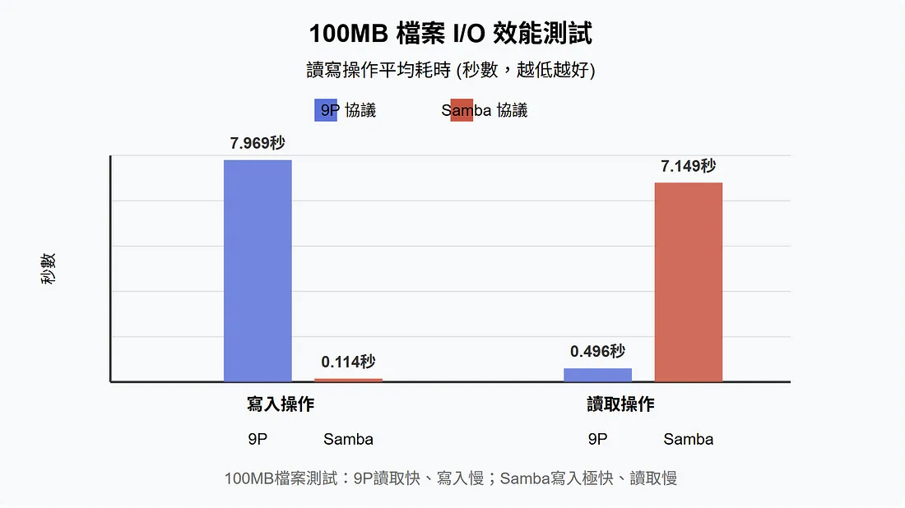

# 引言
由于各家芯片原厂提供的`SDK`依赖的开发环境不同，比如同样是全志的芯片，
对于`t113`系列最佳的适配开发用发行版是`ubuntu 18.04`和`debian 10`，
而对于`t527`系列最佳的适配开发用发行版则是`ubuntu 22.04`和`debian 11`。
如果我统一使用`debian 11`，就编译不过`t113`系列的`SDK`，
而使用`debian 10`，又可能在编译`t527`系列的`SDK`时遇到一些小问题。

而我还有其他不同的芯片，如果每一个芯片对应一个虚拟机，实在太占资源了，
所以我想到了使用`docker`容器技术，将各个芯片的开发环境打包成一个镜像，
这样就可以在不同的机器上运行，而且可以共享开发环境，节省资源。

# 开发流程构思
首先在我的开发流程上，可以简单的认为有三个机器：
1. PC：运行各种开发软件的宿主机，推荐`windows`，有些芯片厂只有`windows`版本烧录软件。
2. HOST：用于给`docker`容器提供资源，可以选择`virtualbox`、`wsl2`等虚拟环境。
3. CONTAINER：针对每一个芯片的开发环境，也就是`docker`容器，与`HOST`共享内核资源。

## 资源共享
整个的资源流向为：`CONTAINER`构建输出->`HOST`存储中转->`PC`烧写使用。

`PC`与`HOST`之间共享文件，根据使用的虚拟机环境确定，常见下面几种方式：
1. `vmware`和`virtualbox`提供的基于`fuse`的共享文件系统，可以直接挂载到`HOST`上。
2. `wsl2`提供的修改过的`9p`协议，可以直接挂载到`HOST`上。
3. `PC`开启文件夹共享(`SMB`协议)，`HOST`通过`cifs`挂载。

我放弃使用`SMB`回退到`9p`了，`SMB`和`docker`的卷挂载有冲突，修改`fstab`配置
```fstab
# //127.0.0.1/SMB /mnt/hgfs/share cifs file_mode=0664,dir_mode=0775,gid=me,iocharset=utf8,credentials=/root/.smb/win,x-systemd.automount,x-systemd.mount-timeout=30,_netdev 0 0
/mnt/d/SMB /mnt/hgfs/share none bind,nofail 0 0
```
>> ~~我个人使用的方式为`wsl2 + SMB`，`wsl2`性能较好，同时使用`SMB`避免了`9p`孱弱的写性能。~~

[参考网址](https://allenkuo.medium.com/windows-wsl2-i-o-效能實測與-9p-vs-samba-比較分析-6724c00478ab)

`HOST`与`CONTAINER`之间共享文件，可以直接挂载到`CONTAINER`上，
而且在挂载的时候，还可以把`9P/SMB`挂载的`PC`目录映射到`CONTAINER`上。

# docker参考
这里以基于全志的`t113`系列构建的`docker`为例，介绍如何构建一个可用的开发环境：

## 目录树
```
.
├── build.sh      # 快速使用构建脚本
├── common
│   ├── bash      # 基础bash配置
│   ├── git       # 基础git配置
│   └── ssh       # 基础ssh配置，存放ssh登录用的公钥
└── t113
    ├── clangd                    # clangd工具，提供代码补全、跳转等功能
    ├── docker-compose.yml        # docker-compose配置文件
    ├── Dockerfile                # 构建镜像用的Dockerfile
    ├── elts-archive-key.gpg      # 使用debian buster，需要导入ELTS公钥提供apt源
    ├── gen_compile_commands.py   # kernel 生成compile_commands.json文件
    ├── repo                      # 适配t113系列的repo工具
    ├── sources.list              # apt source列表
    └── vsc_helper.tgz            # vscode不支持ubuntu 18后的解决方法
```
> `vsc_helper`是为了解决`vscode`不支持`ubuntu 18`后的问题，参考这两个网站：
- [官方网站](https://code.visualstudio.com/docs/remote/faq#_can-i-run-vs-code-server-on-older-linux-distributions)
- [一个Dockerfile](https://github.com/naitaku/old-linux-vscode/blob/main/Dockerfile)

## docker 配置
```/etc/docker/daemon.json
{
  "userns-remap": "me", # 基于用户名启用`user-namepsace`保护，docker中root用户等效于主机当前用户`me`
  "registry-mirrors": [
    "https://docker.xuanyuan.me",
    "https://docker.1ms.run",
    "https://hub-mirror.c.163.com",
    "https://docker.m.daocloud.io"
  ]
}
```

## docker-compose.yml
```yaml
services:
  t113:
    init: true
    build:
      context: ../
      dockerfile: t113/Dockerfile
    image: t113:V1.0.8
    hostname: t113
    container_name: t113
    ulimits:
      nofile:
        soft: 1024
        hard: 524288
    ports:
      - "18898:22"
    volumes:
      - /srv/tftp/:/srv/tftp
      - /mnt/hgfs/share:/mnt/hgfs/share
      - ~/.local/bin:/root/.local/bin:ro
      - /workspace/t113:/workspace/t113
      - /workspace/note:/workspace/note
      - ~/.local/share/todo:/root/.local/share/todo
    restart: unless-stopped
```
> 如果用`wsl2 + mirrored`模式，建议端口映射的高一点，免得`windows`扯幺蛾子。
>> 这里映射的工作目录和主机源码存放目录一致主要是为了后续可以在主机使用编译出来的东西，
>> 比如在使用qt的时候，如果主机目录和docker目录不一致，会导致qmake编译时找不到库。

## 启动容器
```bash
docker compose -f t113/docker-compose.yml up -d --build # 构建镜像并启动容器
ssh root@localhost -p 18898  # 使用 ssh 与密钥登录容器
docker exec -it t113 /bin/bash  # 进入容器，可以用命令行操作
docker stop t113  # 停止容器
docker start t113  # 启动容器，默认开机自动启动
docker compose -f t113/docker-compose.yml down # 停止并删除容器
```

# 常见问题
## 构建过程中解压文件失败
如果在构建过程中，解压文件失败，可能是因为使用的是`root`用户解压，
而`root`用户解压的文件`uid`和`gid`默认是用户压缩的时候的，
而如果`docker`使用了`user-namespace`隔离，给容器提供的`id`资源上限不够，就会解压失败，
比如下面的配置中，提供的`uid`资源上限只有`65536`个，也就是如果你要解压一个压缩包，
压缩的用户其`uid`大于了`65536`，就会解压失败。
```
$ cat /etc/sub?id
me:1000:1
me:100000:65536
me:1000:1
me:100000:65536
```
解决方式：添加环境变量`TAR_OPTIONS="--no-same-owner"`。强制解压不保持原`uid`和`gid`。
> `buildroot`需要通过`menuconfig`配置`BR2_TAR_OPTIONS`，因为全局配置会被覆盖。
>> 理论上配一个`alias tar='tar --no-same-owner'`，应该可以避开`buildroot`的影响。
>> 实际测试没用，可能是因为别人直接调用类似`/bin/tar`命令，不在乎`alias`。

## 部分命令慢或者报错
修改文件描述符限制：
```yaml
    ulimits:
      nofile:
        soft: 1024
        hard: 524288
```
> 等效`docker run --ulimit nofile=1024:524288 your_image`

## 编译buildroot过程不允许使用root
添加环境变量: `FORCE_UNSAFE_CONFIGURE=1`
> 或者修改`tar.mk`，在`HOST_TAR_CONF_ENV`里面添加这个环境变量。

## 不能通过`loop`设备访问文件
如果用了`user-namespace`隔离，就没办法控制`loop`设备了，于是就不方便制作一个镜像了。
还好参考`buildroot`的源码，发现了一些好东西：`genimage`命令，
这个命令可以根据需求直接把多个文件制作成一个镜像，而且不需要任何的特权，容器友好。
