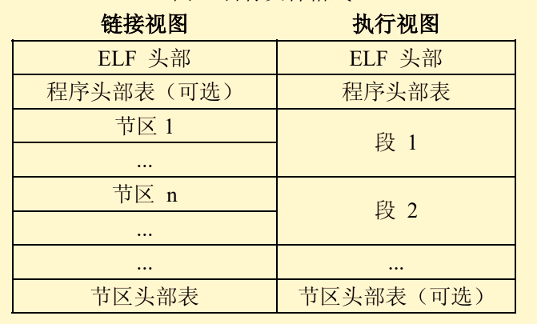
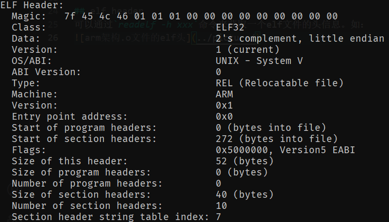
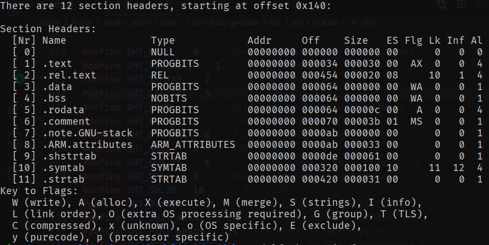

## 什么是elf
elf: Executable and Linking Format，可执行链接格式。主要有三种类型：
1. 可重定位文件(Relocatable File)，包含适合于与其他目标文件链接来创建可
执行文件或者共享目标文件的代码和数据，如 `*.a`, `*.o`。
2. 可执行文件(Executable File)，包含适合于执行的一个程序，此文件规定了
`exec()`如何创建一个程序的进程映像，如`a.out`。
3. 共享目标文件(Shared Object File)，包含可在两种上下文中链接的代码和数
据。首先链接编辑器可以将它和其它可重定位文件和共享目标文件一起处理，
生成另外一个目标文件。其次，动态链接器（Dynamic Linker）可能将它与某
个可执行文件以及其它共享目标一起组合，创建进程映像，如`*.so`。

## elf格式
由于目标文件既要参与程序链接又要参与程序运行，所以提供了两种并行视图：


1. ELF头部描述整个文件的结构组织。  
2. 程序头部表告诉系统如何创建进程映像，用来构建进程映像的目标文件必须
存在这个表，可重定位文件不需要。
3. 节区部分包含了大量链接时的信息，如指令、数据、符号表、重定位信息等等。
4. 节区头部表描述文件节区信息，每一个节区在表中都有一项。每一项给出诸如
节区名称、节区大小这类信息。用于链接的目标文件必须包含节区头部表，
其他目标文件可以有，也可以没有这个表。

## elf header
可以通过`readelf -h xxx`命令来获取一个elf文件的头信息。如：

关于这个信息的获取，可以查看`/usr/include/elf.h`文件，共52字节:
```c
#define EI_NIDENT (16)
typedef struct
{
  uchar	e_ident[EI_NIDENT];     /* Magic number and other info */
  Elf32_Half	e_type;			/* Object file type */
  Elf32_Half	e_machine;		/* Architecture */
  Elf32_Word	e_version;		/* Object file version */
  Elf32_Addr	e_entry;		/* Entry point virtual address */
  Elf32_Off	    e_phoff;		/* Program header table file offset */
  Elf32_Off	    e_shoff;		/* Section header table file offset */
  Elf32_Word	e_flags;		/* Processor-specific flags */
  Elf32_Half	e_ehsize;		/* ELF header size in bytes */
  Elf32_Half	e_phentsize;	/* Program header table entry size */
  Elf32_Half	e_phnum;		/* Program header table entry count */
  Elf32_Half	e_shentsize;	/* Section header table entry size */
  Elf32_Half	e_shnum;		/* Section header table entry count */
  Elf32_Half	e_shstrndx;		/* Section header string table index */
} Elf32_Ehdr;
```

通过该结构体可以发现，上图中的`Magic`值即为该结构体中的`e_ident`项。
关于`e_ident`项可以看作是一个如下的结构体：
```c
struct Elf_ident {
    uchar del;          /* ascii 0x7f, means DEL */
    uchar e;            /* ascii 0x45, means E */
    uchar l;            /* ascii 0x4c, means L */
    uchar f;            /* ascii 0x46, means F */
    uchar class;        /* 1 means 32-bit, 2 means 64-bit */
    uchar endian;       /* 1 means little endian, 2 means big endian */
    uchar ver;          /* version of file, must as 1 */
    uchar OSABI;        /* os abi identification, usually as 0 */
    uchar abiVer;       /* abi version, usually as 0 */
    uchar PAD[3];       /* Byte index of padding bytes */
}
```

## 节区头部表
对于节区头部表可以通过`readelf -S xxx`来查看相应的信息，如：


通过上面的`Elf32_Ehdr->e_shoff`得到节区头部表相对整个文件的偏移情况，
也就找到了对应数据。然后查看`elf.h`文件，找出这部分数据对应的结构如下：
```c
typedef struct
{
    Elf32_Word	sh_name;		/* Section name (string tbl index) */
    Elf32_Word	sh_type;		/* Section type */
    Elf32_Word	sh_flags;		/* Section flags */
    Elf32_Addr	sh_addr;		/* Section virtual addr at execution */
    Elf32_Off	  sh_offset;	/* Section file offset */
    Elf32_Word	sh_size;		/* Section size in bytes */
    Elf32_Word	sh_link;		/* Link to another section */
    Elf32_Word	sh_info;		/* Additional section information */
    Elf32_Word	sh_addralign;	/* Section alignment */
    Elf32_Word	sh_entsize;		/* Entry size if section holds table */
} Elf32_Shdr;
```
其中`sh_name`仅表示一个索引值，该`section`对应的名字需要在`string table`中
按照所得的下标查询。

## 值得关注的节区
### strtab，字符串表
存储符号表所需的字符串，使用空字符作为字符串之间的间隔。
对于可重定位文件而言必须存在，可执行文件和共享目标文件则为可选的。

### dynstr，动态链接字符串表
供`dynsym`所需的字符串查询，同`strtab`相似，但可重定位文件中不应该存在。

### symtab，符号表
存储整个目标文件中的符号信息，该节区的类型为`SHT_SYMTAB`。
对于可重定位文件而言必须存在，可执行文件和共享目标文件则为可选的。
```c
typedef struct
{
  Elf32_Word	st_name;		/* Symbol name (string tbl index) */
  Elf32_Addr	st_value;		/* Symbol value */
  Elf32_Word	st_size;		/* Symbol size */
  unsigned char	st_info;		/* Symbol type and binding */
  unsigned char	st_other;		/* Symbol visibility */
  Elf32_Section	st_shndx;		/* Section index */
} Elf32_Sym;
```
该符号具体的名字需要在`strtab section`按照`st_name`中的值进行查询。

### dynsym，动态链接符号表
相当于`symtab`的子集，但其作用为供动态链接时链接器查询所用，
在共享目标文件和需要使用动态库的可执行文件中必须存在。

### rel.*，重定位表
存储该目标文件中的重定位信息。
```c
typedef struct
{
  Elf32_Addr	r_offset;		/* Address */
  Elf32_Word	r_info;			/* Relocation type and symbol index */
} Elf32_Rel;
```
通过`r_info`右移`8bit`得到该符号相对与`symbol`或者`dynsym`表项的索引，
而后得出对应的函数名字。
