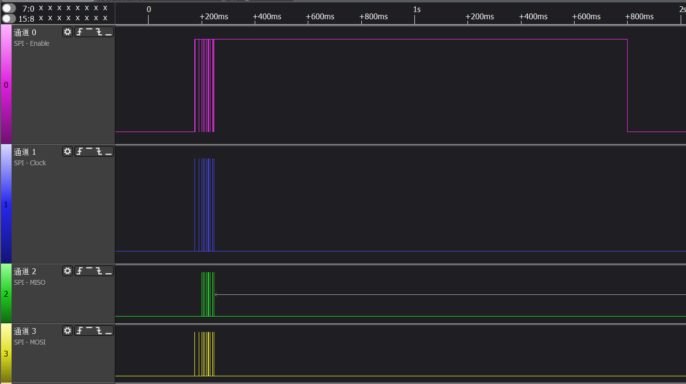

## cs默认高低
最近调试手机驱动，发现在我发送spi之前cs脚默认是低，但是设置是cs拉低为传输，
也即默认cs脚应该是高。


但是使用同事代码则发现cs脚是常高的。仔细分析移植后发现区别在于dts中对该spi资源描述
的区别：
```dts
spi_3 {
	spi_3_active: spi_3_active {
		mux {
			pins = "gpio8", "gpio9",
					"gpio10", "gpio11";
			function = "blsp_spi3";
		};

		config {
			pins = "gpio8", "gpio9",
					"gpio10", "gpio11";
			drive-strength = <6>;
			bias-disable;
		};
	};

	spi_3_sleep: spi_3_sleep {
		mux {
			pins = "gpio8", "gpio9",
					"gpio10", "gpio11";
			function = "gpio";		// 此处我是用的是设置为gpio模式
//			function = "blsp_spi3";	// 同事配置为的依然是spi模式
		};

		config {
			pins = "gpio8", "gpio9",
					"gpio10", "gpio11";
			drive-strength = <6>;
			bias-disable;
		};
	};
};
```
也就是基于上述区别，我默认的cs脚是低，而同事的则是高。结合逻辑分析仪抓取的情况来看，
可以知道的是linux会在不使用的时候配置为sleep模式。仅在使用时配置为active。